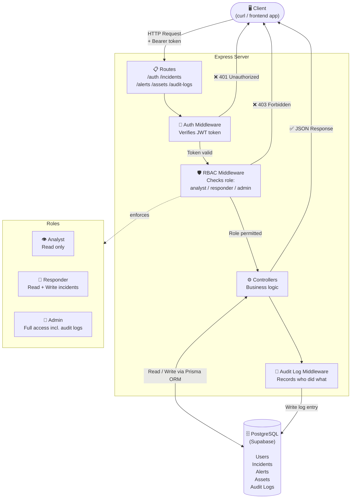

# Security Incident Management API

A production-oriented REST API for security operations teams to track and manage incidents, alerts, and assets. Built with Node.js, Express, PostgreSQL (Supabase), and Prisma ORM.

## What it does

This backend service gives a security operations team a structured way to:

- **Log and track incidents** — security events with severity levels (critical → low) and lifecycle statuses (open → investigating → contained → resolved → closed)
- **Attach alerts** — raw signals from SIEMs or other detection tools, linked to the relevant incident
- **Manage assets** — an inventory of infrastructure (servers, workstations, etc.) that can be associated with incidents
- **Audit everything** — every write operation is automatically logged with who did it, what they changed, and when

Access is controlled by JWT authentication and three role tiers: analysts can read, responders can read and write, and admins have full access including audit logs.

## Architecture



Every request passes through three gates before anything happens:

1. **Auth** — validates the JWT token. No token or an expired one returns a `401`.
2. **RBAC** — checks whether the user's role permits the requested action. Insufficient permissions return a `403`.
3. **Controller** — the actual business logic runs here, reading from or writing to the database via Prisma.

After any successful write, the audit middleware automatically records a log entry — supporting non-repudiation and forensic investigation.

## Tech stack

| Layer | Technology |
|---|---|
| Runtime | Node.js 20 |
| Framework | Express 4 |
| Database | PostgreSQL via Supabase |
| ORM | Prisma 6 |
| Auth | JWT (jsonwebtoken) + bcrypt |
| Security headers | Helmet |
| Rate limiting | express-rate-limit |
| Testing | Jest + Supertest |

## Quickstart

```bash
cd security-incident-api
npm install
cp .env.example .env        # add your DATABASE_URL and JWT_SECRET
npm run db:migrate:deploy
npm run seed
npm run dev
```

See [`security-incident-api/README.md`](./security-incident-api/README.md) for the full API reference, curl examples, and security design notes.

## Running tests

```bash
cd security-incident-api
npm run db:migrate:deploy
npm run seed
npm test
```

Tests are Jest + Supertest integration tests that run against a real database. All 10 tests cover authentication flows and role-based access control enforcement.
